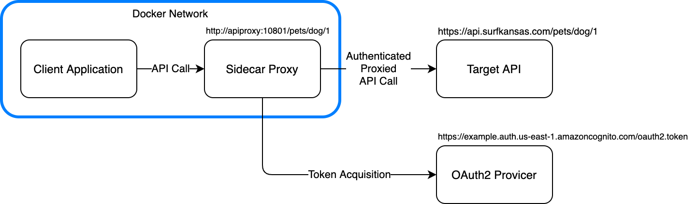

# OAuth2 Client Credentials API Sidecar Container

This is a sidecar proxy container that provides OAuth2 Client Credential Grant authorization to an a client application without the client application needing to implement any OAuth2 code directly.

Using a sidecar proxy for OAuth2 allows client application code to be more concise.  It also allows an application developer to test locally using a non-authenticated API emulation with the exact same code used in deployment.

## Architecture



The sidecar proxy runs as a separate host inside of your Docker network.  The client application talks directly to the proxy over unauthenticated HTTP traffic.

When starting up, the sidecar proxy acquires an access token from the configured OAuth2 provider's token endpoint.  It then starts a background loop that
renews the token 5 minutes before the previous token expires.

When the client application makes a call to the API endpoint in the sidecar proxy, the proxy in turn calls the real HTTPS API endpoint.  It adds the Authorization header to the call, as well as an optional API key.  

## Using the Container

The proxy is run as a Docker container. To use it, you need to supply a handful of environment variables.

For example, you would create an environment file called *proxy.env* with content such as the following...

```proxy.env```
```
AUTH_ENDPOINT_URL=https://example.auth.us-east-1.amazoncognito.com/oauth2/token
AUTH_CLIENT_ID=1234567890abcdef123455678
AUTH_CLIENT_SECRET=abcdefghijklmnopqrstuvwxyz1234567890abcdefghijklmnop
AUTH_SCOPE=pets.read pets.write
PROXY_API_KEY=thisismyapikey12345678901234567890
PROXY_API_KEY_HEADER=x-api-key
PROXY_DOWNSTREAM_URL=https://api.surfkansas.com
PROXY_PORT=10801
```

You then would run the container as follows...

```bash
docker run --env-file proxy.env -p 10801:10801 surfkansas/oauth2-client-credentials-api-sidecar
```

Once the container is up an running, you will be able to make calls to the container on your configured port.  Traffic will be proxied to the downstream API with the appropriate authorization headers supplied.

## Environment Variables

The proxy is completely controlled via environment variables. 

* **`AUTH_ENDPOINT_URL`** : Full path to the OAuth2 token endpoint to be called when authenticating
* **`AUTH_CLIENT_ID`** : The client ID that will be passed to the OAuth2 endpoint
* **`AUTH_CLIENT_SECRET`** : The client secret that will be passed to the OAuth2 endpoint (obviously, keep this one secret and never check it into a GIT repo)
* **`AUTH_SCOPE`** : (Optional) Space separated list of scopes to request from the OAuth2 token endpoint
* **`PROXY_API_KEY`** : (Optional) If specified, the proxy passes this key in the API key header, which defaults to `x-api-key` but can be overridden using the `PROXY_API_KEY_HEADER` environment variable
* **`PROXY_API_KEY_HEADER`** : (Optional, defaults to `x-api-key`) If the `PROXY_API_KEY` environment variable is specified, the API key value will be passed to the downstream with this named HTTP header
* **`PROXY_DOWNSTREAM_URL`** : Specifies the host and scheme of the downstream API to be proxied
* **`PROXY_PORT`** : (Optional, defaults to `10801`) If supplied, specifies the port the sidecar proxy should listen on.

## Contributions

I happily accept any feedback or pull requests to make this product better.

## Thanks

This product was made possible by extending and modifying an example reverse proxy created by Ben Church.

https://github.com/bechurch/reverse-proxy-demo